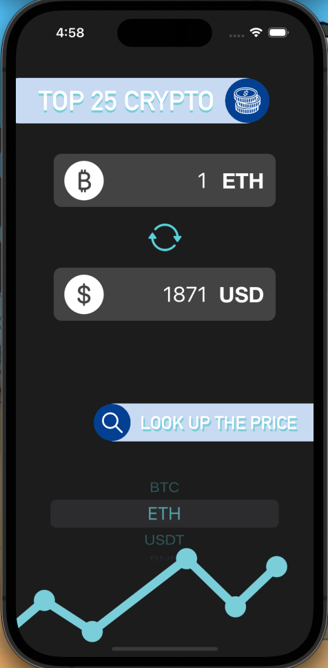

# Bitcon-iOS-Development-Bootcamp

<!--
*** Hello! I am currently practicing building iOS Apps.
*** This is my own modified version of ByteCoin from Angela Yu - The Complete iOS Development Bootcamp
-->


<!-- PROJECT LOGO -->
<div align="center">
  <a href="https://github.com/r1ddx2/Bitcon-iOS-Development-Bootcamp">
    
  </a>

<h3 align="center">Bitcon</h3>

  <p align="center">
    A converter of Top 25 crypto currencies to US dollars real time
  </p>
</div>


<!-- TABLE OF CONTENTS -->
<details>
  <summary>Table of Contents</summary>
  <ol>
    <li>
      <a href="#about-the-project">About The Project</a>
      <ul>
        <li><a href="#built-with">Built With</a></li>
      </ul>
    </li>
    <li><a href="#installation">Installation</a></li>
    <li><a href="#contact">Contact</a></li>
  </ol>
</details>


<!-- ABOUT THE PROJECT -->
## About The Project
<div align="center" style="display: inline-block;">
    
    

</div>

                                                              
                                                                                                                  
  </br>
  
  [Bitcon](https://github.com/r1ddx2/Bitcon-iOS-Development-Bootcamp) is a single view app that fetches top 25 crypto currencies according to their market cap, and converts their value into US dollars. <br>
  This is a modified version of [ByteCoin App](https://github.com/appbrewery/ByteCoin-iOS13-Completed). The original app fetches real time rate of specific currencies. 
  

### Built With

* [Swift](https://developer.apple.com/swift/)


## Installation

1. Clone the repo
   ```sh
   git clone https://github.com/github_username/Bitcon-iOS-Development-Bootcamp.git
   ```
2. Enjoy!

<!-- CONTACT -->
## Contact

Red Wang 
- Email : r1ddx09@gmail.com
- Twitter: [@r1ddx](https://twitter.com/r1ddx) 
- Project Link: [https://github.com/github_username/Bitcon-iOS-Development-Bootcamp](https://github.com/github_username/Bitcon-iOS-Development-Bootcamp)

<p align="left">(<a href="#readme-top">>>> BACK TO TOP</a>)</p>
